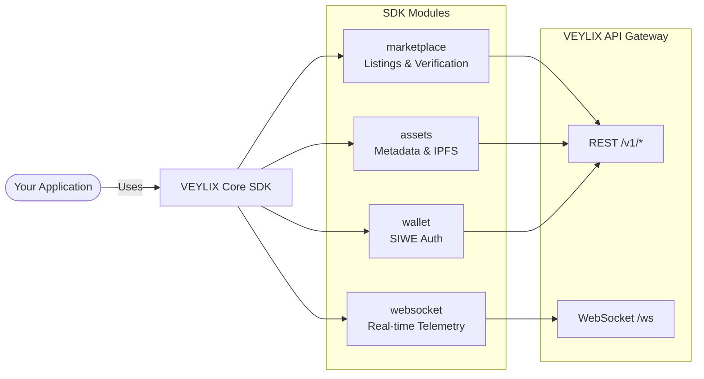

# VEYLIX Core SDK

<p align="center">
  
</p>

<p align="center">
  <a href="https://www.npmjs.com/package/veylix-sdk"></a>
  <a href="https://img.shields.io/badge/TypeScript-5.x-3178C6?style=flat-square&logo=typescript&logoColor=white"></a>
  <a href="https://img.shields.io/badge/Node.js-18+-339933?style=flat-square&logo=nodedotjs&logoColor=white"></a>
  
  <a href="https://img.shields.io/badge/License-MIT-blue?style=flat-square"></a>
</p>

The **VEYLIX Core SDK** is the official TypeScript/JavaScript client for the VEYLIX decentralized 3D AI generation platform. It provides a fully typed, zero-dependency interface to interact with marketplace listings, 3D asset metadata, wallet authentication (SIWE), and real-time rendering telemetry via WebSocket.

---

## Architecture & Data Flow



---

## Installation

```bash
npm install veylix-sdk
# or
yarn add veylix-sdk
# or
pnpm add veylix-sdk
```

---

## Quick Start

```typescript
import { VeylixClient } from 'veylix-sdk';

// Initialize — defaults to https://dapp.veylixlabs.xyz/api
const client = new VeylixClient();

// Or point to your own gateway instance
// const client = new VeylixClient('https://api.veylixlabs.xyz/v1');
```

---

## Module Reference

### `client.marketplace`

```typescript
// Fetch active marketplace listings (default limit: 10)
const { data, error } = await client.marketplace.getListings(25);

// Verify a 3D asset's spatial integrity before purchase
const { data } = await client.marketplace.verifyAsset('asset-abc123');
// → { verified: true, signature: '0x...' }
```

### `client.assets`

```typescript
// Get full metadata for a 3D asset
const { data } = await client.assets.getAssetDetails('asset-abc123');
// → { id, name, ipfsHash, creator, topologyVerified }

// Fetch raw IPFS metadata directly from the public gateway
// (concurrent-safe — does NOT mutate shared client state)
const { data } = await client.assets.fetchIPFSMetadata('QmXyz123...');
```

### `client.wallet`

```typescript
// 1. Generate a SIWE (Sign-In with Ethereum) payload
const { data } = await client.wallet.generateSiwePayload(
  '0xYourAddress',
  8453 // Base chain (default)
);
// → { nonce: '...', message: '...' }

// 2. Sign the message in your wallet, then verify
const { data } = await client.wallet.verifySignature(message, signature);
// → { token: '...', user: { ... } }
```

### `client.telemetry` (WebSocket)

```typescript
// Lazy-initialized singleton WebSocket
client.telemetry
  .on('render_progress', (event) => {
    console.log(`Job ${event.jobId}: ${event.progress}% — ${event.stage}`);
  })
  .on('gpu_stats', (stats) => {
    console.log(`GPU ${stats.subnetId}: ${stats.utilization}% @ ${stats.temperature}°C`);
  })
  .on('queue_update', (q) => {
    console.log(`Queue: ${q.totalJobs} jobs, ${q.activeWorkers} workers`);
  })
  .on('error', (err) => console.error('[Telemetry]', err));

await client.telemetry.connect();

// Or create a fresh socket with custom options
const socket = client.createTelemetrySocket({
  maxReconnectAttempts: 5,
  heartbeatIntervalMs: 15_000,
});
await socket.connect();

// Graceful disconnect
socket.disconnect();
```

---

## Error Handling

All methods return a typed `ApiResponse<T>` — no thrown exceptions:

```typescript
const { data, error } = await client.marketplace.getListings();

if (error) {
  if (error instanceof VeylixAuthError) {
    console.error('Invalid or missing API key');
  } else {
    console.error(`API error ${error.statusCode}: ${error.message}`);
  }
  return;
}

console.log(data); // Listing[]
```

**Error hierarchy:**
```
VeylixError
└── VeylixAPIError       (statusCode, responseData)
    └── VeylixAuthError  (401/403 — auth failures)
```

---

## Module Structure

| Module | File | Description |
| :--- | :--- | :--- |
| `VeylixClient` | `src/client.ts` | Core HTTP wrapper, auth, and base URL config |
| `MarketplaceModule` | `src/modules/marketplace.ts` | Listings, asset verification |
| `AssetsModule` | `src/modules/assets.ts` | Asset metadata, IPFS gateway fetching |
| `WalletModule` | `src/modules/wallet.ts` | SIWE nonce generation and signature verification |
| `TelemetrySocket` | `src/modules/websocket.ts` | Real-time WebSocket with auto-reconnect & heartbeat |
| Error classes | `src/errors.ts` | `VeylixError`, `VeylixAPIError`, `VeylixAuthError` |

---

## Development

```bash
# Install dependencies
npm install

# Run in watch mode (rebuilds on change)
npm run dev

# Run tests (50 tests)
npm test

# Run tests in watch mode
npm run test:watch

# Build (ESM + CJS + DTS)
npm run build

# Generate API docs
npm run docs
```

---

## License

MIT — see [LICENSE](./LICENSE) for more details.

---
<div align="center">
  <p>Built with 💜 by the <a href="https://github.com/VeylixLabs">VeylixLabs Team</a></p>
  <p><strong>VEYLIX</strong> · Decentralized Synthetic Production Infrastructure for Virtual AAA Worlds.</p>
</div>
