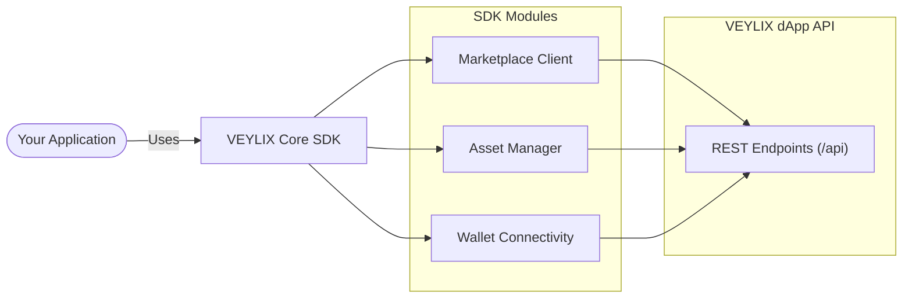

# VEYLIX Core SDK

<p align="center">
  
</p>

<p align="center">
  <a href="https://img.shields.io/badge/TypeScript-5.9-3178C6?style=flat-square&logo=typescript&logoColor=white"></a>
  <a href="https://img.shields.io/badge/Node.js-18+-339933?style=flat-square&logo=nodedotjs&logoColor=white"></a>
  <a href="https://img.shields.io/badge/Next.js_Compatible-000000?style=flat-square&logo=nextdotjs&logoColor=white"></a>
  <a href="https://img.shields.io/badge/License-Apache_2.0-blue?style=flat-square"></a>
</p>

The **VEYLIX Core SDK** provides a fully typed TypeScript and JavaScript interface to interact with the VEYLIX dApp APIs. Designed for seamless integration into Node.js backends and Next.js frontends, it simplifies interactions with spatial solvers, asset registries, marketplace endpoints, and AI models.

## Architecture & Data Flow



## Installation

```bash
npm install veylix-sdk
# or
yarn add veylix-sdk
# or
pnpm add veylix-sdk
```

## Quick Start

```typescript
import { VeylixClient } from 'veylix-sdk';

// Initialize the client
const client = new VeylixClient('https://app.veylix.com/api');

// Example: Fetching marketplace listings (To be implemented)
// const listings = await client.marketplace.getListings();
```

## Module Structure

| Module | Description |
| :--- | :--- |
| `client` | Core HTTP wrapper with authentication and base URL configuration. |
| `marketplace` | Modules for fetching listings, verifying assets, and interacting with the Web3 marketplace. |
| `assets` | Interfacing with the spatial registry and 3D asset metadata. |
| `wallet` | Utilities for signing messages and interacting with the dApp's wallet layer. |

---

## License

Apache 2.0 - see [LICENSE](./LICENSE) for more details.

---
**VEYLIX** • Decentralized Synthetic Production Infrastructure for Virtual AAA Worlds.
